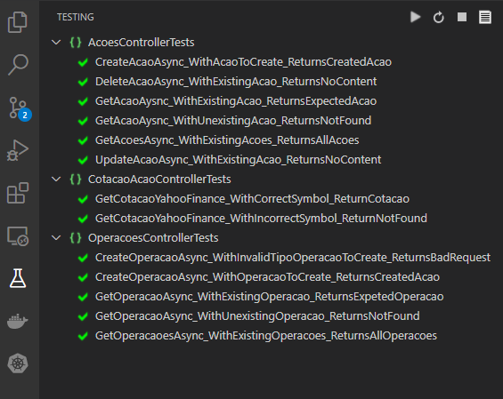
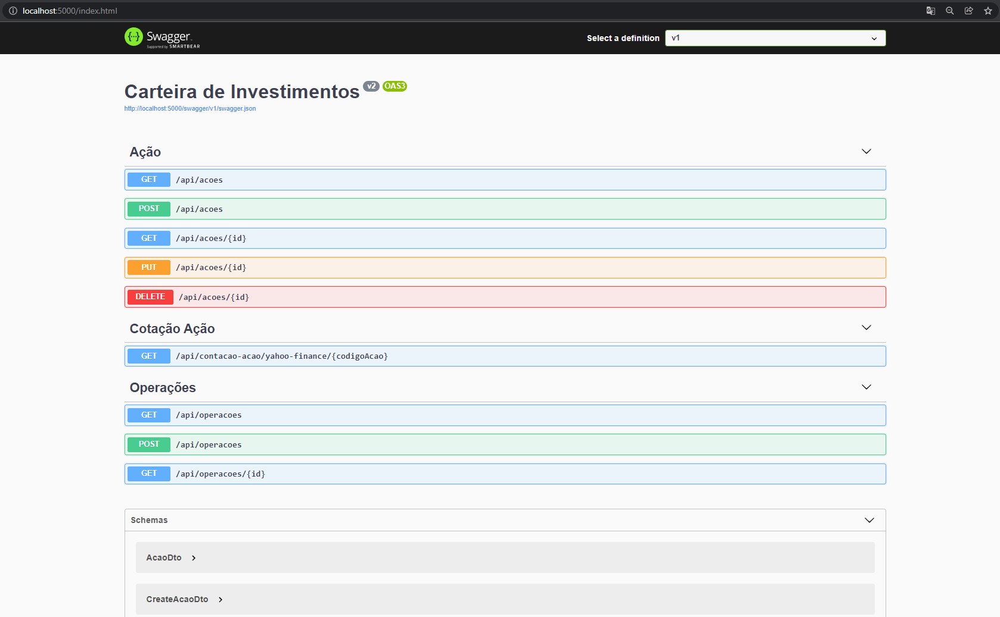
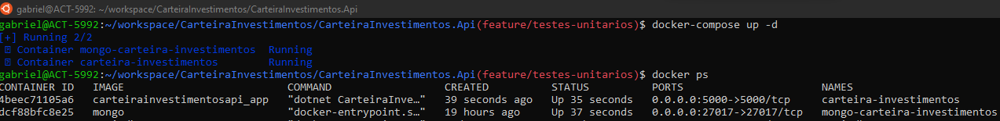

### Rodar projeto
```bash
cd CarteiraInvestimentos.Api && dotnet run

# Via Docker
cd CarteiraInvestimentos.Api && docker-compose up --build -d

# Via VS Code
CarteiraInvestimentos.Api > F5

# Rodar projeto local, somente com o container do mongo executando
CarteiraInvestimentos.Api > appsettings.json > MongoDbSettings > Host > "localhost"
docker-compose -f docker-compose-mongo.yml up --build -d
CarteiraInvestimentos.Api > F5
```

### Rodar os testes
```bash
cd CarteiraInvestimentos.UnitTests && dotnet test
```

### Resultados dos testes


### Swagger da aplicação


### Container em execução


#### Comandos executados para criar e atualizar o Projeto durante o desenvolemento
```bash
# Criar o projeto
dotnet new webapi -n CarteiraInvestimentos

# Habilitar rodar o projeto em desenvolvimento com https sem ssl
dotnet dev-certs https --trust

# Pacote para converter o json recebido da api do yahoo finance
dotnet add package Newtonsoft.Json

# MongoDB
dotnet add package MongoDB.Driver

# Health Check MongoDB
dotnet add package AspNetCore.HealthChecks.MongoDb

# Testes unitários
dotnet new xunit -n CarteiraInvestimentos.UnitTests

# Dentro das pasta CarteiraInvestimentos.UnitTests
dotnet add reference ../CarteiraInvestimentos.Api/CarteiraInvestimentos.Api.csproj
dotnet add package Microsoft.Extensions.Logging.Abstractions
dotnet add package moq
dotnet add package FluentAssertions
```


